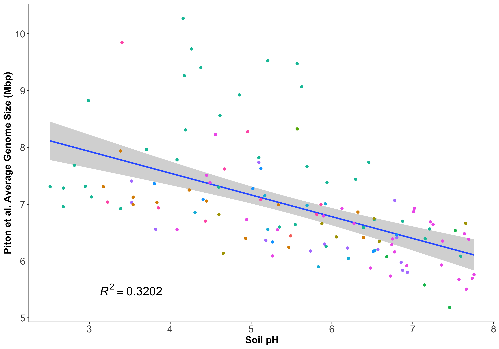

# 2024 reply to Osmund et al. and Piton et al.
Raphael Eisenhofer

### Import and clean data

``` r
library(tidyverse)
library(janitor)
library(patchwork)

pooled_smf <- read_delim("data/smf.csv")
md <- read_delim("data/metadata.tsv") %>%
  clean_names()
enviro_data <- readxl::read_excel("data/Global_Data.xlsx", 
                                  sheet = 7) %>%
  clean_names()
avg_genome_size <- readxl::read_excel("data/Global_Data.xlsx", 
                                      sheet = 1) %>% 
  select(sample_name, `Average Genome size (bp)`) %>%
  clean_names()

# join tables
df <- pooled_smf %>%
  inner_join(md, by = join_by("sample" == "sample_alias"), 
             suffix=c("", ".y")) %>%
  select(-ends_with(".y")) %>% 
  inner_join(enviro_data, by = join_by(sample_name)) %>% 
  inner_join(avg_genome_size, by = join_by(sample_name)) %>%
  distinct(sample, .keep_all = T) %>%
  type.convert(., as.is =TRUE) %>%
  clean_names()
```

We’re left now with 126 samples (close to the original 128).

### How much eukaryotic DNA are in these samples?

Piton et al. asserted that:

> “However, given that eukaryotic sequences represent \<2% of annotated
> sequences, we might also expect only a small fraction of eukaryotic
> sequences in the unannotated base pairs.”
>
> “Indeed, assuming an extreme range of 4–9% eukaryotic base pairs..”

Let’s now use our SMF (**S**ingleM **M**icrobial **F**raction) estimates
to check how much non-bacterial DNA there is in these samples:

``` r
set.seed(1337)

fig1a <- df %>%
  mutate(environment_biome = str_replace_all(environment_biome,
                                             "_", " ")) %>%
  ggplot(aes(x = environment_biome, y = (100 - read_fraction), 
             colour = environment_biome)) +
  geom_boxplot(outlier.alpha = 0) +
  geom_hline(yintercept = (100 - median(df$read_fraction)),
             linetype = 2, colour = "grey") +
  geom_jitter(height = 0, width = 0.3, alpha = 0.7) +
  theme_classic() +
  theme(
    legend.position = "none",
    axis.text.x = element_text(size = 14,
                               angle = 45, 
                               hjust = 1),
    axis.text.y = element_text(size = 14),
    axis.title = element_text(size = 14, face = "bold")
        ) +
  ylab("Eukaryotic fraction (%)") +
  xlab("Soil environment")
  
fig1a
```


OK, so the assertion that 4-9% of the base pairs are eukaryotic is a
severe underestimate! 9.7- to 4.3 -fold understimations to be precise.

It’s also interesting that we do see variation in non-bacterial read
fractions between soil environmental biomes.

### How accurate are Osmund and Piton et al.’s AGS estimates?

Piton et al.’s original AGS (**A**verage **G**enome **S**ize) estimates
are based on the tool MicrobeCensus. Here’s the summary from the
[original 2015
paper](https://link.springer.com/article/10.1186/s13059-015-0611-7):

> “Specifically, the AGS of a community will be inversely proportional
> to the relative abundance, R, of an essential single-copy gene in that
> community: AGS ∝ R -1. In other words, these essential genes will be
> sequenced at a higher rate in a community with a small AGS relative to
> a community with a large AGS; this is simply because these genes make
> up a larger fraction of the total genomic DNA in the community with
> smaller genomes.”

So essentially, a major assumption here is that most (if not all) of the
metagenome is bacterial. If you had substantial euk DNA, you would
severely overestimate the AGS of the metagenome — as the single-copy
core genes will be artificially lower in relative abundance -\> higher
AGS estimate.

Osmund et al. were correct in pointing out this major assumption. In
their reply, they calculated AGS using only reads that aligned to
bacterial genomes, and reported a much lower AGS: 3 Mbp, vs Piton et
al.’s 6.8 Mbp.

SMF can help here, as it:

1.  Accounts for the fact that different metagenomes can have different
    proportions of eukaryotic DNA
2.  Is not reliant on alignment to reference genomes

Let’s see where SMF’s AGS estimates lie between Piton et al. and Osmund
et al.s’:

``` r
SMF_AGS <- as.numeric(scales::number(mean(df$average_bacterial_archaeal_genome_size) / 1000000, accuracy = 0.1))  

AGS_overestimate_fold <- as.numeric(scales::number(6.8 / SMF_AGS, accuracy = 0.01)) 

AGS_overestimate_pc <- (1 - as.numeric(scales::number(SMF_AGS / 6.8, accuracy = 0.001))) * 100 
```

So SMF’s AGS estimate 4.7 Mbp is between Osmund et al.’s 3 Mbp and Piton
et al.’s 6.8 Mbp. With Piton et al.’s 6.8 Mbp being a 1.45 -fold
overestimate (30.9 %).

### Does Piton et al.’s original relationship between AGS and soil pH still supported?

Now that we have more robust AGS estimates thanks to SMF, let’s see if
this relationship is still supported. This was Osmund et al.’s main
point:

> “Therefore, we suggest that the strong association of very large AGS
> with acidic soils in the full metagenomes is likely an artefact of
> ecosystems with acidic soils having larger proportions of
> non-bacterial DNA.”

``` r
#First, recrete with Piton et al.'s original AGS values

# lm_piton <- lm(average_genome_size_bp ~ soilp_h, df)
# shapiro.test(residuals(lm_piton))
# 
# summary(lm_piton)


glm_piton <- glm(average_genome_size_bp ~ soilp_h, 
                 df, family = Gamma)

summary(glm_piton)
```


    Call:
    glm(formula = average_genome_size_bp ~ soilp_h, family = Gamma, 
        data = df)

    Coefficients:
                 Estimate Std. Error t value Pr(>|t|)    
    (Intercept) 1.018e-07  5.709e-09  17.824  < 2e-16 ***
    soilp_h     7.724e-09  1.046e-09   7.381 1.98e-11 ***
    ---
    Signif. codes:  0 '***' 0.001 '**' 0.01 '*' 0.05 '.' 0.1 ' ' 1

    (Dispersion parameter for Gamma family taken to be 0.01335263)

        Null deviance: 2.2440  on 125  degrees of freedom
    Residual deviance: 1.5254  on 124  degrees of freedom
    AIC: 3776.5

    Number of Fisher Scoring iterations: 4

``` r
#R squared
r_piton <- paste0("~italic(R^2)", " == ", scales::number(with(summary(glm_piton), 1 - deviance/null.deviance), accuracy = 0.0001))


fig1b <- df %>%
  ggplot(aes(x = soilp_h, y = average_genome_size_bp / 1e6)) +
  geom_smooth(method = "glm") +
  geom_point(aes(colour = environment_biome)) +
  annotate("text", x = 3.5, y = 5.5, label = r_piton, 
           parse = TRUE, size = 6) +
  theme_classic() +
  theme(
    legend.position = "none",
    axis.text = element_text(size = 14),
    axis.title = element_text(size = 14, face = "bold")
        ) +
  labs(x = "Soil pH", y = "Piton et al. Average Genome Size (Mbp)")


fig1b
```

    `geom_smooth()` using formula = 'y ~ x'



``` r
#Now with corrected AGS values

glm_smf <- glm(average_bacterial_archaeal_genome_size ~ soilp_h, 
               df, family = Gamma)

r_smf <- paste0("~italic(R^2)", " == ", scales::number(with(summary(glm_smf), 1 - deviance/null.deviance), accuracy = 0.0001))

fig1c <- df %>%
  ggplot(aes(x = soilp_h, 
             y = average_bacterial_archaeal_genome_size / 1e6)) +
  geom_smooth(method = "glm") +
  geom_point(aes(colour = environment_biome)) +
  annotate("text", x = 3.5, y = 4, label = r_smf, 
           parse = TRUE, size = 6) +
  theme_classic() +
  theme(
    legend.position = "none",
    axis.text = element_text(size = 14),
    axis.title = element_text(size = 14, face = "bold")
        ) +
  labs(x = "Soil pH", y = "SingleM Average Genome Size (Mbp)")

fig1c
```

    `geom_smooth()` using formula = 'y ~ x'


Despite their inaccurate AGS estimates, we actually observe a stronger
relationship between AGS and soil pH: ~italic(R^2) == 0.5724, compared
to Piton et al. ~italic(R^2) == 0.3202.

### Export figure for paper (Figure 1)

``` r
fig1 <- fig1a / (fig1b + fig1c) + plot_annotation(tag_levels = 'A')  

ggsave("figures/figure_1.png", fig1, width = 9, height = 12)
```

    `geom_smooth()` using formula = 'y ~ x'
    `geom_smooth()` using formula = 'y ~ x'

### AGS vs soil pH by biome (Supplementary Figure 1)

``` r
set.seed(1337)

df %>%
  mutate(environment_biome = str_replace_all(environment_biome,
                                             "_", " ")) %>%
  filter(environment_biome != "Arctic tundra" & environment_biome != "Grasslands and shrublands") %>%
  ggplot(aes(x = soilp_h, 
             y = average_bacterial_archaeal_genome_size / 1e6, 
             colour = environment_biome)) +
  geom_point(size = 3) +
  facet_wrap(~environment_biome) +
  geom_smooth(method = "glm") +
  theme_classic() +
  theme(
    legend.position = "none",
    axis.text.x = element_text(size = 14),
    axis.text.y = element_text(size = 14),
    axis.title = element_text(size = 14, face = "bold")
        ) +
  ylab("Average Genome Size (Mbp)") +
  xlab("Soil pH")
```


### Validation with an independent dataset (Supplementary Figure 2)

Piton et al. cite an [independent study](u) of soil metagenomes that
also found the same relationship between AGS and soil pH. Let’s see if
we also observe this trend.

``` r
wang <- read_delim("data/ben/ncomms_paper/ncomms_collected.csv")
```

    Rows: 36 Columns: 14
    ── Column specification ────────────────────────────────────────────────────────
    Delimiter: ","
    chr (4): Run, sample.name, sample, site.latitude
    dbl (9): bacterial_archaeal_bases, metagenome_size, read_fraction, average_b...
    lgl (1): warning

    ℹ Use `spec()` to retrieve the full column specification for this data.
    ℹ Specify the column types or set `show_col_types = FALSE` to quiet this message.

``` r
glm_wang <- glm(average_bacterial_archaeal_genome_size~ pH, 
                wang, family = Gamma)

summary(glm_wang)
```


    Call:
    glm(formula = average_bacterial_archaeal_genome_size ~ pH, family = Gamma, 
        data = wang)

    Coefficients:
                 Estimate Std. Error t value Pr(>|t|)    
    (Intercept) 1.752e-07  5.979e-09  29.303  < 2e-16 ***
    pH          7.551e-09  1.210e-09   6.242 4.18e-07 ***
    ---
    Signif. codes:  0 '***' 0.001 '**' 0.01 '*' 0.05 '.' 0.1 ' ' 1

    (Dispersion parameter for Gamma family taken to be 0.001157308)

        Null deviance: 0.085232  on 35  degrees of freedom
    Residual deviance: 0.039343  on 34  degrees of freedom
    AIC: 968.99

    Number of Fisher Scoring iterations: 3

``` r
#R squared
r_wang <- paste0("~italic(R^2)", " == ", scales::number(with(summary(glm_wang), 1 - deviance/null.deviance), accuracy = 0.0001))


wang %>%
  ggplot(aes(x = pH, y = average_bacterial_archaeal_genome_size / 1e6)) +
  geom_smooth(method = "glm") +
  geom_point(aes(colour = site.latitude), size = 5) +
  annotate("text", x = 4, y = 4.3, label = r_wang, 
           parse = TRUE, size = 6) +
  theme_classic() +
  theme(
    legend.position = "right",
    axis.text = element_text(size = 14),
    axis.title = element_text(size = 14, face = "bold")
        ) +
  labs(x = "Soil pH", y = "SMF Average Genome Size (Mbp)")
```

    `geom_smooth()` using formula = 'y ~ x'


### Supplemental analyses

``` r
df %>% 
  ggplot(aes(x = soilp_h, y = read_fraction)) + 
  geom_smooth(method = "glm") +
  geom_point(aes(colour = environment_biome), size = 3) +
  theme_classic() +
  theme(
    legend.position = "top",
    legend.title = element_blank(),
    axis.text = element_text(size = 14),
    axis.title = element_text(size = 14, face = "bold")
        ) +
  labs(x = "Soil pH", y = "SingleM Microbial Fraction (%)")
```

    `geom_smooth()` using formula = 'y ~ x'


``` r
df %>% 
  ggplot(aes(x = mean_annual_temperature_c, y = read_fraction)) + 
  geom_smooth(method = "glm") +
  geom_point(aes(colour = environment_biome), size = 3) +
  theme_classic() +
  theme(
    legend.position = "top",
    legend.title = element_blank(),
    axis.text = element_text(size = 14),
    axis.title = element_text(size = 14, face = "bold")
        ) +
  labs(x = "Mean annual temp (C)", y = "SingleM Microbial Fraction (%)")
```

    `geom_smooth()` using formula = 'y ~ x'


``` r
df %>% 
  ggplot(aes(x = annual_precipitation_mm, y = read_fraction)) + 
  geom_smooth(method = "glm") +
  geom_point(aes(colour = environment_biome), size = 3) +
  theme_classic() +
  theme(
    legend.position = "top",
    legend.title = element_blank(),
    axis.text = element_text(size = 14),
    axis.title = element_text(size = 14, face = "bold")
        ) +
  labs(x = "Annual precipitation (mm)", y = "SingleM Microbial Fraction (%)")
```

    `geom_smooth()` using formula = 'y ~ x'


``` r
df %>% 
  ggplot(aes(x = mapping_coverage_kegg, y = read_fraction)) + 
  geom_smooth(method = "glm") +
  geom_point(aes(colour = environment_biome), size = 3) +
  theme_classic() +
  theme(
    legend.position = "top",
    legend.title = element_blank(),
    axis.text = element_text(size = 14),
    axis.title = element_text(size = 14, face = "bold")
        ) +
  labs(x = "Mean mapping coverage KEGG", y = "SingleM Microbial Fraction (%)")
```

    `geom_smooth()` using formula = 'y ~ x'


### Report package/software versions reproducibility

``` r
installed.packages()[names(sessionInfo()$otherPkgs), "Version"]
```

    patchwork   janitor lubridate   forcats   stringr     dplyr     purrr     readr 
      "1.2.0"   "2.2.0"   "1.9.3"   "1.0.0"   "1.5.1"   "1.1.4"   "1.0.2"   "2.1.5" 
        tidyr    tibble   ggplot2 tidyverse 
      "1.3.1"   "3.2.1"   "3.4.4"   "2.0.0" 
